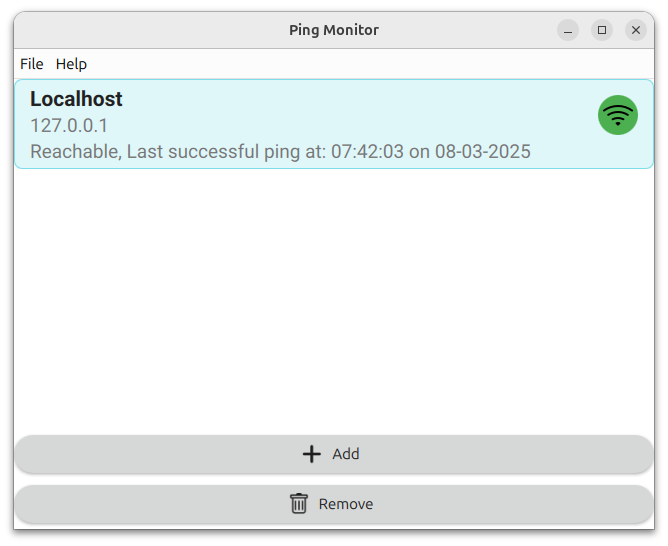

# Ping Monitor

- [Introduction](#introduction)
- [Running the app](#running-the-app)

## Introduction
GUI app to check if the connected devices are communicating or not.



## Running the app

### Run the app from sources
```bash
# Install Poetry
sudo apt install python3-poetry

# Clone the source and install dependencies
git clone https://github.com/nrasulnrasul/ping_monitor.git
cd ping_monitor/
poetry install
poetry run ping_monitor
